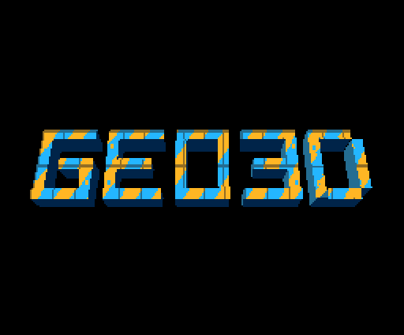
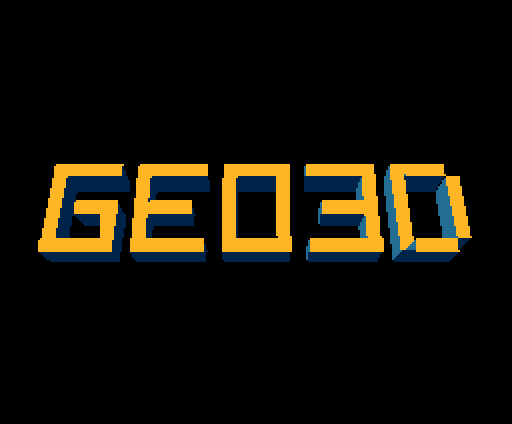
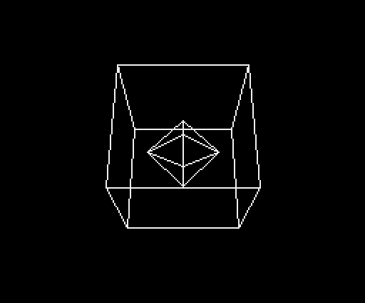

# geo3d: 3D geometry coprocessor prototype for MSX + V9968

A small vertex transform and perspective projection unit in Verilog, with an
8-bit I/O interface for the Z80, synthesized for the same FPGA used by the
V9968 cartridge (Gowin GW2AR-LV18QN88C8/I7, Tang Nano 20K).

Personal project by Alex Moncks. Not part of the official V9968 by HRA!.

## What it does
- 3x3 matrix in Q2.14 plus translation, 16-bit signed vertices (3 parallel multipliers)
- Perspective projection: SX = CX + X*F/Z, SY = CY - Y*F/Z (16-step sequential divider)
- Near-plane rejection, saturation flags and screen outcodes (Cohen-Sutherland)
- Z80 interface: 2 I/O ports (VDP-style index/data). Streaming mode: OTIR of
  6 bytes per vertex, INIR of 7 bytes per result, no index repositioning

### Register map (byte index, little-endian 16-bit words)
| Index | Register |
|---|---|
| 0x00-0x11 | M00..M22 (Q2.14) |
| 0x12-0x17 | TX, TY, TZ |
| 0x18 / 0x1A / 0x1C | F (focal length), CX, CY |
| 0x1E / 0x20 / 0x22 | ZNEAR, W, H |
| 0x24 / 0x26 / 0x28 | VX, VY, VZ (writing 0x29 starts the computation) |
| 0x30-0x36 (read) | SX, SY, Z, FLAGS |

FLAGS: bit0 NEAR, bit1 OVFX, bit2 OVFY, bit3 BUSY, bit4 SX<0, bit5 SX>=W,
bit6 SY<0, bit7 SY>=H. Port 0 read returns FLAGS without side effects.

## Verification
4,000 random vectors (including stress, near-plane and saturation cases),
compared bit-exact against the Python reference model: 0 errors.
Latency: up to 49 clocks per vertex (measured in the testbench).

## Resource usage (Yosys + nextpnr-himbaechel, GW2AR-18)
| Resource | geo3d | Device |
|---|---|---|
| LUT4 | 761 | 20,736 |
| ALU | 521 | |
| Flip-flops | 709 | 15,552 |
| MULT18X18 | 4 | 48 |
| BSRAM | 0 | 46 |
| PLL | 0 | 2 |

Post-route Fmax (nextpnr): about 143 MHz (targets tested: 42.95 and 85.91 MHz, both PASS).

Note: the V9968 cartridge report comes from Gowin EDA, while these numbers come
from Yosys/nextpnr, which count resources and model timing differently. The
definitive figure needs integration into the cartridge project and a Gowin EDA build.

## Phase 2: geo3d drives the V9968 command engine (branch `geo3d-phase2`)

The Z80 uploads the model once. Every frame it only sends **30 bytes**
(page offset, one precomputed matrix, RUN) and geo3d does the rest:
transform all vertices, clip every edge to the screen, and write R#36..R#46
LINE commands straight into the V9968 command engine whenever CE = 0.

| Per frame, cube + octahedron (14 vertices, 24 edges) | Phase 1 (Z80 drives VDP) | Phase 2 |
|---|---|---|
| Z80 I/O to geo3d | 182 (14 x 13) | 30 |
| Z80 writes to VDP command registers | ~312 (24 LINEs) | 0 |
| Z80 arithmetic (clipping, LINE setup) | yes | none |
| Grows with model size | yes | no (up to 255 vertices / 255 edges) |

### How it works
1. Transform phase: each vertex in vertex RAM goes through geo3d_core.
2. Edge phase, per edge: skip if an endpoint is behind the near plane or saturated;
   cull if trivially outside; otherwise clip to [0,W) x [0,H) with midpoint
   bisection (adders only, no divider) and build the LINE command.
3. The issuer sends the 11 command bytes when the VDP is idle, while the clipper
   already works on the next edge.

### Register window additions
| Index | Register |
|---|---|
| 0x40 / 0x41 | VADDR / EADDR (model RAM write pointers) |
| 0x42 / 0x43 | NVERT / NEDGE (0..255) |
| 0x44 / 0x45 | COLOR (R#44) / LOP (low nibble of R#46) |
| 0x46-0x47 | YPAGE, added to every DY (draw into the back page) |
| 0x48 | write bit0 = RUN, read = status |
| 0x4A-0x4F | SKIPPED, DRAWN, CULLED counters (16-bit, read) |
| 0x50 | vertex stream, 6 bytes per vertex (index does not move) |
| 0x51 | edge stream, 2 bytes per edge (index does not move) |

Status (index port read, no side effects): bit0 RUN busy, bit1 transform phase,
bit2 edge phase, bit3 core busy.

While RUN busy = 1 the Z80 must not write R#32..R#46 nor geo3d configuration.
Clearing the back page (HMMV) and flipping pages (R#2) stay with the Z80.

### Ports on the cartridge
geo3d answers at offsets 5 and 7 of the slot's 8-port block: **8Dh** (index/status)
and **8Fh** (data) with the DIP switch at 88h, or 9Dh / 9Fh at 98h.
Offset 6 (8Eh) is left free on purpose because the MegaRAM uses it.

### Integration into the cartridge (`integration/apply_geo3d_patch.py`)
- `src/v9968/vdp.v`: 4 new ports; the external command-register write is OR-ed
  into `vdp_command`, and CE is exported. With the port idle the VDP is unchanged.
- `src/tangnano20k_vdp_cartridge.v`: instantiates `geo3d_bus` (bus side on clk85m, engine on clk42m), keeps offsets 5/7
  away from the VDP, muxes read data and ready.
- `tangnano20k_vdp_cartridge.gprj`: adds the three geo3d RTL files.
The script is idempotent and byte-preserving (Shift-JIS comments, CRLF).

### Verification
- 24 random scenes / 75 frames (cubes, spheres, random meshes, far and near
  cameras, 4 screen sizes, page offsets, logical ops): 2,792 LINE commands
  bit-exact against the Python reference model, 0 writes while CE = 1.
- The real Z80 demo (`z80/geo3d_demo.asm`) executed in a Z80 emulator for 130 frames
  (across the loop point); its captured port traffic replayed on the RTL:
  3,120 LINE commands, identical to the model.
  `docs/geo3d_demo.gif` and `docs/demo_frames.png` rasterise those commands with the
  same LINE stepping as `vdp_command.v` (`sim/render_video.py`, which also writes an MP4).
- Phase 1 regression (4,000 vectors) passes on the engine's immediate mode.

### Resources and timing (Yosys / nextpnr, GW2AR-18)

Clocks: the bus side of `geo3d_bus` and the VDP interface run on clk85m (85.9 MHz);
the engine runs on clk42m (42.95 MHz, the cartridge's existing clk85m / 2, same
phase and already declared in its SDC). Crossings use toggles; `sim/tb_bus.v`
replays the scenes through the msx_slot-style handshake with both clocks running.

| | Engine (P&R, all modes) | Cartridge original | Cartridge + geo3d | Delta |
|---|---|---|---|---|
| LUT | 6,976 | 8,750 | 13,443 | +4,693 |
| ALU | 2,334 | 892 | 2,999 | +2,107 |
| FF | 4,234 | 4,941 | 9,160 | +4,219 |
| BSRAM | 12 | 8 | 20 | +12 |
| MULT18X18 | 5 | 1 | 6 | +5 |

Engine Fmax after P&R (wireframe + faces + textures): 60 MHz on clk_eng (needs
42.95 MHz); the 85.9 MHz bus side closes above 400 MHz. Textures added 916 LUT,
320 ALU, 689 FF and 3 BSRAM to the engine (`syn/nextpnr_engine_faces.log` vs
`syn/nextpnr_engine_textures.log`).

Cartridge columns: the full project synthesised with Yosys
(`syn/cartridge/synth_cartridge.sh`), the encrypted Gowin DVI IP replaced by a
black box. Yosys maps less densely than Gowin EDA (8,750 vs 6,009 LUT for the
original); scaled to the Gowin report the total logic is roughly 56% of the
device, but CLS utilisation is likely around 80-90%. It should still fit, with
little room left. A Gowin EDA build is needed for the real figures.

## Filled, shaded faces (CTRL bit1 = 1)

Same 30 bytes per frame from the Z80; geo3d now draws solid objects:

1. `LM = transpose(R) * L`: the light direction moved into model space (9 multiplies per frame).
2. Per face (convex quad; a triangle repeats its last vertex): skip if a vertex is
   behind the near plane or saturated; cull back faces by the sign of the projected
   area; flat shade `level = min(6, 7 * max(0, LM . N))`, colour = `BASE + level`;
   depth key = sum of the 4 camera-space Z.
3. Painter's order: farthest face first (ties by lower face index).
4. Each face is filled row by row. The span between the leftmost and rightmost edge
   crossing (exact floor division, no rounding drift) is clipped to the screen and
   sent as one horizontal LINE command.

The V9968 has no polygon fill command, so the VDP still paints every pixel;
geo3d decides which rows, where they start and end, and which tone.

| Index | Register |
|---|---|
| 0x48 | CTRL: bit0 RUN, bit1 filled faces |
| 0x52 | face stream: I0, I1, I2, I3, NX, NY, NZ (Q2.14 words), BASE colour (11 bytes) |
| 0x58 / 0x59 | FADDR / NFACE |
| 0x5A-0x5F | LX, LY, LZ: direction towards the light, camera space, Q2.14 |

Counters in this mode: SKIPPED = near faces, CULLED = back faces, DRAWN = faces drawn.

**Verification:** 16 random scenes / 43 frames (closed boxes, non-planar quads,
triangles, arbitrary lights, off-screen and near-plane cameras): 52,164 spans
bit-exact against the Python model. The real Z80 program `z80/geo3d_faces_demo.asm`
(the word GEO3D as 21 extruded blocks, 168 vertices, 126 faces, two 7-tone ramps)
ran for 130 frames in the Z80 emulator: 133,709 spans identical to the model,
0 writes while CE = 1. Wireframe and phase 1 regressions still pass.

**VDP load:** about 1,000 spans and 9,400 pixels per frame for the GEO3D demo.
With the V9938-compatible LINE timing of the cartridge RTL (about 163 clocks per
pixel from its wait constants) that is roughly 18 ms of drawing per frame, before
the page clear; high-speed mode is far below that. Real figures need hardware.

## Textured faces (CTRL bit2 = 1): the V9968 LRMM command

The V9968 already has what texture mapping needs: LRMM copies pixels from a
source position that advances by a signed 8.8 step (VX, VY) per destination pixel.
geo3d sends one LRMM per span, so the VDP fetches every texel itself from a spare
VRAM page. No VDP change, no texture memory in geo3d.

- Texture: kept anywhere in the 256 KB VRAM (the demo uses page 2, y = 512), as 7
  pre-shaded copies stacked `TSTRIDE` rows apart; the face's light level picks the
  copy, so shading stays free.
- Per face: 4 texture coordinates (U, V, 0-255) sent once through index 0x53.
  A face is textured when its BASE colour has bit7 set; other faces keep the
  solid LINE spans.
- Per span: U and V are interpolated along the left and right edges (8.8 fixed
  point, floor division), then `VX = dU/dX`, `VY = dV/dX` for the row. Affine
  mapping, like the consoles of the time; no perspective correction.
- Enabling LRMM on the cartridge: PORT#4 (8Ch) bit7 = 0 unlocks R#20/R#21,
  R#21 bit0 (V58) = 0 selects V9968 mode (extended commands and 256 KB
  addressing), R#20 bit0 = high-speed commands. `z80/geo3d_tex_demo.asm` does it.

| Index | Register |
|---|---|
| 0x48 | CTRL: bit0 RUN, bit1 faces, bit2 textures |
| 0x53 | texture coordinate stream: U0 V0 U1 V1 U2 V2 U3 V3 per face |
| 0x60-0x61 | TEXX: texture origin X in VRAM |
| 0x62-0x63 | TEXY: texture origin Y in VRAM (13 bits; 512 = page 2) |
| 0x64 | TSTRIDE: rows between the pre-shaded copies |
| 0x65 | TADDR: texture coordinate write pointer |

**Verification, with HRA!'s own RTL as the reference VDP.** `sim/hra/tb_hra_cmd.v`
wraps the unmodified `vdp_command.v` from the cartridge repository with a 256 KB
VRAM; `sim/hra/check_lrmm.py` compares a Python LRMM / LINE model against it:
900 random commands (windows, negative steps, logical ops, clipping at the screen
edge), 256 KB compared byte by byte, 0 differences. That model then checks geo3d:

- 12 random textured scenes: 16,654 LRMM spans and 10,901 LINE spans, bit-exact.
- The real Z80 program `z80/geo3d_tex_demo.asm` (GEO3DT.COM: uploads the texture,
  then 30 bytes per frame), 130 frames in the Z80 emulator: 52,684 LRMM and
  81,025 LINE commands identical to the model.
- End to end (`sim/tb_system.v`): the captured Z80 traffic drives `geo3d_bus`
  (both clocks), which drives HRA!'s `vdp_command.v`, which paints VRAM. Every
  shown page is dumped and compared with the Python VDP model applied to the
  command log (`sim/check_system.py`): all 130 pages identical.
  `docs/geo3d_textures.gif` and the MP4 are rendered from those VRAM pages
  (`sim/render_vram.py`), so the video shows what the V9968 RTL drew.

**VDP load** (high-speed mode, measured on `vdp_command.v` at 85.9 MHz): LRMM about
8.8 clocks per pixel, LINE 6.8. The GEO3D demo averages 405 LRMM spans
(2,700 texels) and 623 LINE spans (6,700 pixels) per frame: under 1 ms of VDP
pixel work. Measured end to end in `sim/tb_system.v`, the longest frame (RUN set
until geo3d reports idle: geometry, sorting, span setup, command issue and
drawing) takes 4.1 ms, well inside a 60 Hz frame (16.7 ms). In V9938-compatible timing LINE costs about 265 clocks per pixel, so
high-speed mode is what makes filled and textured objects practical.

### Known limits (next steps)
- Edges crossing the near plane are skipped (needs 3D clipping before projection).
- W <= 512, H <= 1024.
- Not yet run on hardware or on openMSX.
- The Tang Nano 20K is getting full (see resources above).
- Texture mapping is affine (no perspective correction); a texture row is at most
  4,096 texels wide (LRMM SX is 12 bits).

### Z80 demo
`z80/geo3d_demo.asm` (MSX-DOS .COM, GNU z80asm): SCREEN 5 on the cartridge VDP,
double buffered, 128 precomputed matrices forming one full turn (frame 128 equals
frame 0, so the spin loops forever without a jump); the Z80 does no arithmetic.
Regenerate the table with a different motion in `z80/gen_tables.py`.

## Layout
- rtl/geo3d_core.v    compute core
- rtl/geo3d_z80if.v   Z80 interface (synthesis top)
- sim/gen_vectors.py  reference model and vector generator
- sim/tb_geo3d.v      phase 1 testbench
- syn/                synthesis and P&R reports, test pin constraints
- rtl/geo3d_engine.v  phase 2 renderer (model RAMs, clipper, command issuer)
- rtl/geo3d_bus.v     adapter to the cartridge's msx_slot bus
- sim/gen_scenes.py   phase 2 reference model and scene generator
- sim/tb_engine.v     phase 2 testbench with a V9968 command-engine model
- z80/                demo programs (wireframe, GEO3D faces, GEO3D textured), table generators, Z80-emulator runner
- sim/gen_face_scenes.py random filled-face scenes
- sim/render_video.py rasterises logged LINE commands into MP4 / GIF
- sim/gen_tex_scenes.py random textured scenes
- sim/hra/            harness and models checked against HRA!'s unmodified vdp_command.v
- sim/tb_system.v     end to end: Z80 traffic -> geo3d_bus -> vdp_command.v -> VRAM
- sim/check_system.py compares the painted VRAM pages with the model
- sim/render_vram.py  renders the painted VRAM pages into MP4 / GIF
- syn/cartridge/      whole-cartridge synthesis script and Yosys reports
- integration/        patch that wires geo3d into the cartridge project
- run_all.sh          reproduces everything (iverilog, python3, z80asm, pip: yowasp-yosys, yowasp-nextpnr-himbaechel-gowin, z80)

Source comments are in Portuguese; English translation will follow.

## License
MIT. Copyright (c) 2026 Alex Moncks.
