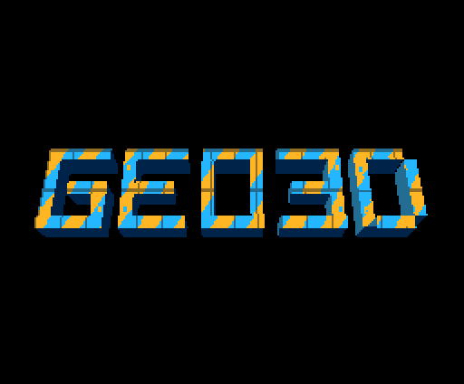
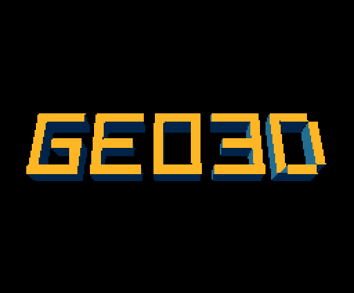
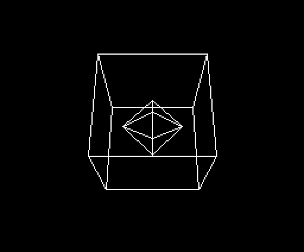
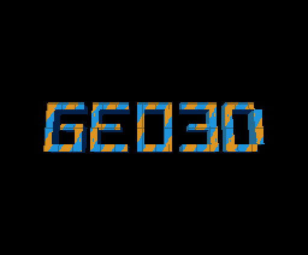
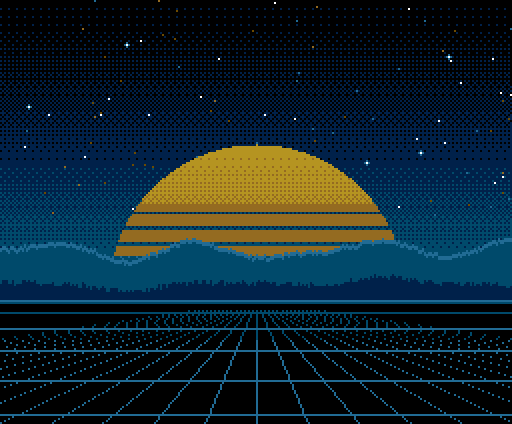
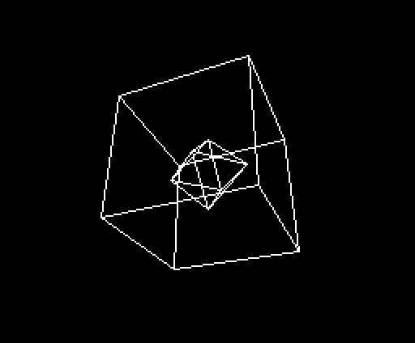
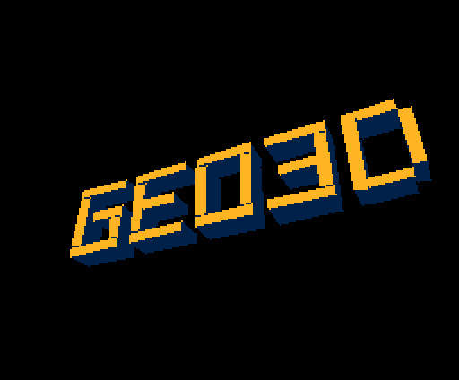
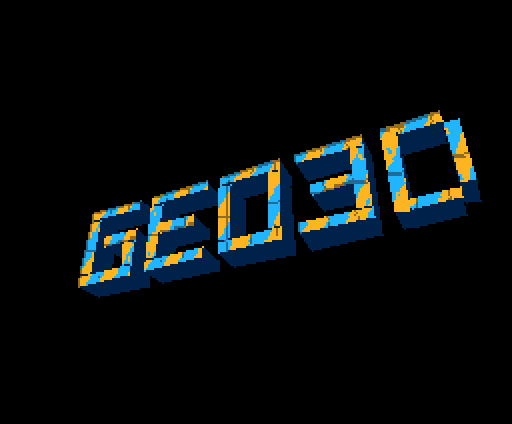
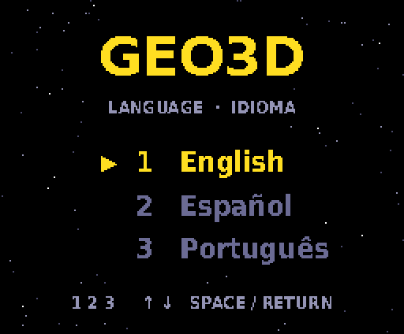

# geo3d: 3D geometry coprocessor prototype for MSX + V9968





A small vertex transform and perspective projection unit in Verilog, with an
8-bit I/O interface for the Z80, synthesized for the same FPGA used by the
V9968 cartridge (Gowin GW2AR-LV18QN88C8/I7, Tang Nano 20K).

Personal project by Alex Moncks. Not part of the official V9968 by HRA!.

## Demos

The demo ROM (language menu, six demos, music) running in openMSX, captured page
flip by page flip. What each one shows, how to run it and how it is checked:
**[demos/](demos/README.md)** in English, [Português](demos/README.pt.md) and
[Español](demos/README.es.md).

<p>



</p>
<p>



</p>
<p>

</p>

## What it does
- 3x3 matrix in Q2.14 plus translation, 16-bit signed vertices (3 parallel multipliers)
- Perspective projection: SX = CX + X*F/Z, SY = CY - Y*F/Z (16-step sequential divider)
- Near-plane rejection, saturation flags and screen outcodes (Cohen-Sutherland)
- Z80 interface: 2 I/O ports (VDP-style index/data). Streaming mode: OTIR of
  6 bytes per vertex, INIR of 7 bytes per result, no index repositioning

### Register map (byte index, little-endian 16-bit words)
| Index | Register |
|---|---|
| 0x00-0x11 | M00..M22 (Q2.14) |
| 0x12-0x17 | TX, TY, TZ |
| 0x18 / 0x1A / 0x1C | F (focal length), CX, CY |
| 0x1E / 0x20 / 0x22 | ZNEAR, W, H |
| 0x24 / 0x26 / 0x28 | VX, VY, VZ (writing 0x29 starts the computation) |
| 0x30-0x36 (read) | SX, SY, Z, FLAGS |

FLAGS: bit0 NEAR, bit1 OVFX, bit2 OVFY, bit3 BUSY, bit4 SX<0, bit5 SX>=W,
bit6 SY<0, bit7 SY>=H. Port 0 read returns FLAGS without side effects.

## Verification
4,000 random vectors (including stress, near-plane and saturation cases),
compared bit-exact against the Python reference model: 0 errors.
Latency: up to 49 clocks per vertex (measured in the testbench).

## Resource usage (Yosys + nextpnr-himbaechel, GW2AR-18)
| Resource | geo3d | Device |
|---|---|---|
| LUT4 | 761 | 20,736 |
| ALU | 521 | |
| Flip-flops | 709 | 15,552 |
| MULT18X18 | 4 | 48 |
| BSRAM | 0 | 46 |
| PLL | 0 | 2 |

Post-route Fmax (nextpnr): about 143 MHz (targets tested: 42.95 and 85.91 MHz, both PASS).

Note: these phase 1 numbers come from Yosys/nextpnr, which count resources and
model timing differently from Gowin EDA. The Gowin EDA build of the whole
cartridge with geo3d is in "Resources and timing" below.

## Phase 2: geo3d drives the V9968 command engine (branch `geo3d-phase2`)

The Z80 uploads the model once. Every frame it only sends **30 bytes**
(page offset, one precomputed matrix, RUN) and geo3d does the rest:
transform all vertices, clip every edge to the screen, and write R#36..R#46
LINE commands straight into the V9968 command engine whenever CE = 0.

| Per frame, cube + octahedron (14 vertices, 24 edges) | Phase 1 (Z80 drives VDP) | Phase 2 |
|---|---|---|
| Z80 I/O to geo3d | 182 (14 x 13) | 30 |
| Z80 writes to VDP command registers | ~312 (24 LINEs) | 0 |
| Z80 arithmetic (clipping, LINE setup) | yes | none |
| Grows with model size | yes | no (up to 255 vertices / 255 edges) |

### How it works
1. Transform phase: each vertex in vertex RAM goes through geo3d_core.
2. Edge phase, per edge: skip if an endpoint is behind the near plane or saturated;
   cull if trivially outside; otherwise clip to [0,W) x [0,H) with midpoint
   bisection (adders only, no divider) and build the LINE command.
3. The issuer sends the 11 command bytes when the VDP is idle, while the clipper
   already works on the next edge.

### Register window additions
| Index | Register |
|---|---|
| 0x40 / 0x41 | VADDR / EADDR (model RAM write pointers) |
| 0x42 / 0x43 | NVERT / NEDGE (0..255) |
| 0x44 / 0x45 | COLOR (R#44) / LOP (low nibble of R#46) |
| 0x46-0x47 | YPAGE, added to every DY (draw into the back page) |
| 0x48 | write bit0 = RUN, read = status |
| 0x4A-0x4F | SKIPPED, DRAWN, CULLED counters (16-bit, read) |
| 0x50 | vertex stream, 6 bytes per vertex (index does not move) |
| 0x51 | edge stream, 2 bytes per edge (index does not move) |

Status (index port read, no side effects): bit0 RUN busy, bit1 transform phase,
bit2 edge phase, bit3 core busy.

While RUN busy = 1 the Z80 must not write R#32..R#46 nor geo3d configuration.
Clearing the back page (HMMV) and flipping pages (R#2) stay with the Z80.

### Ports on the cartridge
geo3d answers at offsets 5 and 7 of the slot's 8-port block: **8Dh** (index/status)
and **8Fh** (data) with the DIP switch at 88h, or 9Dh / 9Fh at 98h.
Offset 6 (8Eh) is left free on purpose because the MegaRAM uses it.

### Integration into the cartridge (`integration/apply_geo3d_patch.py`)
FPGA files only; the cartridge board needs no change. The repository keeps
two Gowin projects side by side, with the same layout and file names:
- `fpga/V9968_Cartridge_TangNano20K/`: HRA!'s project exactly as upstream
  (now his 4410365 of 30 September 2026, with the new shared command cache of
  88132d2), with his own build in `impl/` (the recovery bitstream). Nothing
  here writes to it, so merging his updates never conflicts.
- `fpga/V9968_Cartridge_TangNano20K_geo3d/`: the cartridge with geo3d,
  generated by the script from HRA!'s folder and `rtl/`. `src/` holds the
  files his `.gprj` lists, `src/geo3d/` copies of `rtl/` (edit `rtl/`, then
  run the script again), `impl/` our Gowin build: the bitstream is
  `impl/pnr/tangnano20k_vdp_cartridge.fs`. The Gowin IDE opens its `.gprj`
  as it is.

The patch, in the geo3d project:
- `src/v9968/vdp.v`: 4 new ports; the external command-register write is OR-ed
  into `vdp_command`, and CE is exported. With the port idle the VDP is
  unchanged (formal equivalence check and a lockstep simulation of the whole
  cartridge, repeated on 4410365: 755 of 755 points proven, identical traces).
- `src/tangnano20k_vdp_cartridge.v`: instantiates `geo3d_bus` (bus side on
  clk85m, engine on clk42g), keeps offsets 5/7 away from the VDP, muxes read
  data and ready.
- `src/gowin_rpll2/gowin_rpll2.v`: exposes the PLL's CLKOUTD (already set to
  CLKOUT / 2 = 42.95 MHz) as `clkoutd`; the top names it clk42g and uses it only
  for geo3d. HRA!'s clk42m (from the CLKDIV) still clocks the HDMI and his logic.
- `src/tangnano20k_vdp_cartridge.sdc`: clk42g as a generated clock (clk14m x 3)
  with 0.5 ns of clock uncertainty on the clk85m / clk42g crossings.
- `tangnano20k_vdp_cartridge.gprj`: adds `src/geo3d/geo3d_core.v`,
  `geo3d_engine.v` and `geo3d_bus.v`.

The script only reads HRA!'s folder, is idempotent and byte-preserving
(Shift-JIS comments, CRLF). On every run it checks the PLL settings, the SDC
clocks, the bus read mux and the nets and ports geo3d is hooked to, and it
writes nothing if HRA!'s text has moved. It does not overwrite hand edits in
the geo3d project either: `geo3d_manifest.txt` records what it generated,
and `--force` backs an edit up before overwriting it.
`python3 integration/apply_geo3d_patch.py --check` writes nothing and
verifies that the geo3d project is current (in particular `src/geo3d` =
`rtl/`); `integration/test_apply_geo3d_patch.sh` tests the script on
temporary copies. The script needs Python 3 (Linux, macOS, WSL or Windows);
`syn/gowin/build_gowin.sh` runs from Git Bash on Windows, where Gowin EDA is
installed, and runs the `--check` first (with WSL's python3 if Windows has
no Python).

### Verification
- 24 random scenes / 75 frames (cubes, spheres, random meshes, far and near
  cameras, 4 screen sizes, page offsets, logical ops): 2,792 LINE commands
  bit-exact against the Python reference model, 0 writes while CE = 1.
- The real Z80 demo (`z80/geo3d_demo.asm`) executed in a Z80 emulator for 130 frames
  (across the loop point); its captured port traffic replayed on the RTL:
  3,120 LINE commands, identical to the model.
  `docs/geo3d_demo.gif` and `docs/demo_frames.png` rasterise those commands with the
  same LINE stepping as `vdp_command.v` (`sim/render_video.py`, which also writes an MP4).
- Phase 1 regression (4,000 vectors) passes on the engine's immediate mode.

### Resources and timing (Gowin EDA, GW2AR-LV18QN88C8/I7)

Clocks: the bus side of `geo3d_bus` and the VDP interface run on clk85m
(85.9 MHz); the engine runs on clk42g (42.95 MHz from the same PLL, CLKOUTD).
Crossings use toggles; `sim/tb_bus.v` replays the scenes through the
msx_slot-style handshake with both clocks running.

Full cartridge built with Gowin EDA V1.9.12.03 on HRA!'s 4410365, with his own
project settings (`syn/gowin/build_gowin.sh` builds the geo3d project in
place, as the IDE's "Run All", and fails on any negative slack):

| | HRA! stock | Cartridge + geo3d |
|---|---|---|
| Logic (LUT + ALU) | 7,469 (37%) | 13,130 (64%) |
| Registers | 4,513 (29%) | 7,863 (50%) |
| CLS | 5,768 (56%) | 9,137 (89%) |
| BSRAM / DSP | 10 / 3 | 22 / 9 |
| Fmax clk85m (85.909 MHz needed) | 90.2 MHz | 85.91 MHz |
| Fmax engine clock (42.955 MHz needed) | - | 68.1 MHz (clk42g) |
| Negative-slack paths, every clock pair, setup / hold / recovery / removal | 0 | 0 |

HRA!'s column is his own build in `impl/`. On his previous base (86361d8) the
same build gave 12,756 logic, 7,536 registers, 8,886 CLS, 86.3 MHz on clk85m
and 64.1 MHz on clk42g. On 4410365 the worst clk85m setup path has +0.001 ns
of slack: it is in HRA!'s sprite logic (`ff_screen_pos_x_clone` to
`ff_sprite_overmap_id`), not in geo3d, and it moves with placement, so any
later RTL change can tip it; `build_gowin.sh` reports that with exit code 2.

Gowin's "Total Negative Slack" summary shows 0 even when paths between clocks
fail; the build script reads the path tables instead. With the engine on HRA!'s
clk42m (from the CLKDIV, which has no insertion delay in Gowin's timing model)
the same build had 73 failing paths on the geo3d crossings; that is why geo3d
has its own clock. The open-source flow (Yosys + nextpnr) routes HRA!'s design
but cannot place the one with geo3d (98.6% of the sites), so Gowin EDA is the
reference. Details, the board-level check and the first power-on plan:
[docs/cartridge_report.md](docs/cartridge_report.md)
([Português](docs/cartridge_report.pt.md), [日本語](docs/cartridge_report.ja.md)).

## Filled, shaded faces (CTRL bit1 = 1)

Same 30 bytes per frame from the Z80; geo3d now draws solid objects:

1. `LM = transpose(R) * L`: the light direction moved into model space (9 multiplies per frame).
2. Per face (convex quad; a triangle repeats its last vertex): skip if a vertex is
   behind the near plane or saturated; cull back faces by the sign of the projected
   area; flat shade `level = min(6, 7 * max(0, LM . N))`, colour = `BASE + level`;
   depth key = sum of the 4 camera-space Z.
3. Painter's order: farthest face first (ties by lower face index).
4. Each face is filled row by row. The span between the leftmost and rightmost edge
   crossing (exact floor division, no rounding drift) is clipped to the screen and
   sent as one horizontal LINE command.

The V9968 has no polygon fill command, so the VDP still paints every pixel;
geo3d decides which rows, where they start and end, and which tone.

| Index | Register |
|---|---|
| 0x48 | CTRL: bit0 RUN, bit1 filled faces |
| 0x52 | face stream: I0, I1, I2, I3, NX, NY, NZ (Q2.14 words), BASE colour (11 bytes) |
| 0x58 / 0x59 | FADDR / NFACE |
| 0x5A-0x5F | LX, LY, LZ: direction towards the light, camera space, Q2.14 |

Counters in this mode: SKIPPED = near faces, CULLED = back faces, DRAWN = faces drawn.

**Verification:** 16 random scenes / 43 frames (closed boxes, non-planar quads,
triangles, arbitrary lights, off-screen and near-plane cameras): 52,164 spans
bit-exact against the Python model. The real Z80 program `z80/geo3d_faces_demo.asm`
(the word GEO3D as 21 extruded blocks, 168 vertices, 126 faces, two 7-tone ramps)
ran for 130 frames in the Z80 emulator: 133,709 spans identical to the model,
0 writes while CE = 1. Wireframe and phase 1 regressions still pass.

**VDP load:** about 1,000 spans and 9,400 pixels per frame for the GEO3D demo.
With the V9938-compatible LINE timing of the cartridge RTL (about 163 clocks per
pixel from its wait constants) that is roughly 18 ms of drawing per frame, before
the page clear; high-speed mode is far below that. Real figures need hardware.

## Textured faces (CTRL bit2 = 1): the V9968 LRMM command

The V9968 already has what texture mapping needs: LRMM copies pixels from a
source position that advances by a signed 8.8 step (VX, VY) per destination pixel.
geo3d sends one LRMM per span, so the VDP fetches every texel itself from a spare
VRAM page. No VDP change, no texture memory in geo3d.

- Texture: kept anywhere in the 256 KB VRAM (the demo uses page 2, y = 512), as 7
  pre-shaded copies stacked `TSTRIDE` rows apart; the face's light level picks the
  copy, so shading stays free.
- Per face: 4 texture coordinates (U, V, 0-255) sent once through index 0x53.
  A face is textured when its BASE colour has bit7 set; other faces keep the
  solid LINE spans.
- Per span: U and V are interpolated along the left and right edges (8.8 fixed
  point, floor division), then `VX = dU/dX`, `VY = dV/dX` for the row. Affine
  mapping, like the consoles of the time; no perspective correction.
- Enabling LRMM on the cartridge: PORT#4 (8Ch) bit7 = 0 unlocks R#20/R#21,
  R#21 bit0 (V58) = 0 selects V9968 mode (extended commands and 256 KB
  addressing), R#20 bit0 = high-speed commands. `z80/geo3d_tex_demo.asm` does it.

| Index | Register |
|---|---|
| 0x48 | CTRL: bit0 RUN, bit1 faces, bit2 textures |
| 0x53 | texture coordinate stream: U0 V0 U1 V1 U2 V2 U3 V3 per face |
| 0x60-0x61 | TEXX: texture origin X in VRAM |
| 0x62-0x63 | TEXY: texture origin Y in VRAM (13 bits; 512 = page 2) |
| 0x64 | TSTRIDE: rows between the pre-shaded copies |
| 0x65 | TADDR: texture coordinate write pointer |

**Verification, with HRA!'s own RTL as the reference VDP.** `sim/hra/tb_hra_cmd.v`
wraps the unmodified `vdp_command.v` from the cartridge repository with a 256 KB
VRAM; `sim/hra/check_lrmm.py` compares a Python LRMM / LINE model against it:
900 random commands (windows, negative steps, logical ops, clipping at the screen
edge), 256 KB compared byte by byte, 0 differences. That model then checks geo3d:

- 12 random textured scenes: 16,654 LRMM spans and 10,901 LINE spans, bit-exact.
- The real Z80 program `z80/geo3d_tex_demo.asm` (GEO3DT.COM: uploads the texture,
  then 30 bytes per frame), 130 frames in the Z80 emulator: 52,684 LRMM and
  81,025 LINE commands identical to the model.
- End to end (`sim/tb_system.v`): the captured Z80 traffic drives `geo3d_bus`
  (both clocks), which drives HRA!'s `vdp_command.v`, which paints VRAM. Every
  shown page is dumped and compared with the Python VDP model applied to the
  command log (`sim/check_system.py`): all 130 pages identical.
  `docs/geo3d_textures.gif` and the MP4 are rendered from those VRAM pages
  (`sim/render_vram.py`), so the video shows what the V9968 RTL drew.

**VDP load** (high-speed mode, measured on `vdp_command.v` and its cache at
85.9 MHz by `sim/hra/check_lrmm.py`, VRAM always ready): LRMM about 11.6 clocks
per pixel, LINE 7.0. The GEO3D demo averages 405 LRMM spans
(2,700 texels) and 623 LINE spans (6,700 pixels) per frame: under 1 ms of VDP
pixel work. Measured end to end in `sim/tb_system.v`, the longest frame (RUN set
until geo3d reports idle: geometry, sorting, span setup, command issue and
drawing) takes 4.4 ms, well inside a 60 Hz frame (16.7 ms). In V9938-compatible
timing LINE costs about 225 clocks per pixel, so high-speed mode is what makes
filled and textured objects practical. These figures are for HRA!'s 4410365,
whose shared 8-line command cache (88132d2) takes a few more clocks per access
than the 4-line cache of 86361d8, where the same measurements gave LRMM 8.8,
LINE 5.9 and a 4.1 ms longest frame.

## Showcase videos (`showcase/`)

`showcase/showcase.py` builds three scenes as lists of the port operations a Z80
program would perform (geo3d writes, the Z80's own VDP commands, VRAM uploads,
page flips) and renders them with the Python system model:

- `panzoom`: the textured logo while the camera zooms (focal length F) and pans
  (translation); 33 bytes to geo3d per frame.
- `crawl` (Portuguese), `crawl_en`, `crawl_es`: a perspective text crawl. One
  tilted plane cut into 75 strips, textured by LRMM; the Z80 only moves TEXY
  (2 bytes per frame) and the text scrolls. Two tricks: the light level doubles
  as a texture bank (each strip's normal selects level 1..5, so the plane reaches
  1,200 texture rows through `TEXY + level * TSTRIDE + v`), and the LRMM source
  window (R#51-58) makes everything outside the text transparent (texel = CLR = 0
  with TIMP). One texture row per frame, shown after 3, 3, 3, 2, 3, 3, 3 vertical
  blanks (20 every 7 frames, the player's PACE opcode): 0.7 times the speed of
  one row per 30 fps frame, with every frame one of the full-speed ones. Moving
  the plane by fractions of a row instead was tried and dropped: the engine
  projects whole pixels, so the text stepped backwards in the middle of the
  screen.
- `flyin`: the letters arrive one by one over an original SCREEN 5 scene copied
  from VRAM page 3 every frame (HMMM), then the logo turns. The Z80 only rewrites
  the vertices of the letters in motion.

Checks: the geo3d RTL (`sim/tb_engine.v`) reproduces the model's command log for
every frame of every scene (311,741 LRMM for the Portuguese crawl, 307,629 for
the English one, while the Spanish crawl's geo3d traffic equals the Portuguese
one; 331,152 and 237,232 commands for the other two), and sampled frames run end
to end on geo3d_bus + HRA!'s `vdp_command.v` (`sim/tb_system.v`,
`showcase/check_sample.py`) paint the same pages as the model, in the three
languages.

This caught one model gap: `vdp_command.v` applies TIMP transparency to the
whole CLR byte (0x80 is not transparent) but writes only its low nibble, for LINE
and for LRMM sources outside the window. `sim/hra/check_lrmm.py` now models
this and draws CLR from the full byte range.

## Demo ROM (`rom/`)

`rom/build_rom.py` builds `rom/out/GEO3D.ROM`, a 512 KB MegaROM with the ASCII16
mapper, for a flash cartridge in a second slot next to the V9968 cartridge
(DIP switch at 88h); `--base 0x98` builds `GEO3D_98.ROM` for openMSX (below).
It starts with a language menu (English, Español, Português; keys 1/2/3, or
cursor up/down and SPACE or RETURN), then plays, in a loop: the crawl in that
language (the only text in the demos), the wireframe, the solid blocks, the
textured spin, pan and zoom, and the fly-in. The space bar skips to the next
demo. The picture is on the V9968 HDMI output, at 30 frames per second (the
crawl at 0.7 of that). See [demos/](demos/README.md).

- `rom/geo3d_rom.asm`: the player (about 9.2 KB, bank 0). Each demo is a
  command stream: geo3d writes, VDP register writes, RLE-compressed VRAM
  uploads, wait-for-idle and page flips. The streams are exactly the traffic
  checked above (the .COM demos are captured from their Z80 runs). Pacing uses
  S#0 bit7, which `vdp_cpu_interface.v` sets every frame and clears on read.
  The menu is a stream too; its highlight is a palette change.
- Stream compression (`rom/g3lz.py`): the streams are packed in 8 KB G3LZ
  blocks decoded into RAM (about 426 KB of streams take 170 KB of ROM); the
  setup frames stay uncompressed and data shared by several demos is stored
  once, so every page flip and every black screen falls on the same vertical
  blank as in the uncompressed ROM, and the port traffic is identical.
- geo3d detection: at power on the player reads the VDP ID and geo3d's status
  before writing anything. Without geo3d (for example HRA!'s own bitstream,
  which answers FFh) it shows a "geo3d not found" screen in English, Español and
  Português (the 88h ROM also prints it on the MSX's own screen through the
  BIOS) and stays there. Every wait for geo3d or the command engine gives up
  after about 3 s and shows the same screen.
- Music (`build_rom.py --music FILE`, MIDI or ProTracker MOD; `rom/music.py`,
  `rom/modplay.py`, `rom/geo3d_modplay.asm`): at power on the player uses the
  best chip it finds.
  - A MoonSound with at least 256 KB of sample RAM plays a MOD itself: the
    samples are uploaded during the language menu and the Z80 reads the
    patterns row by row and runs the ProTracker effects tick by tick (including
    vibrato and tremolo), timed by the OPL4's timer 2 at the song's own tempo.
    The whole song loops through all demos. The build refuses a MOD whose CPU
    cost per tick would make a demo frame late (`rom/modcost.py`).
  - Otherwise the music is converted at build time and plays during the crawl:
    the FM part of an OPL4 or an OPL3 at C4h plus the PSG, a Konami SCC plus
    the PSG, or the PSG alone.
  No music file is part of this repository; without `--music` the ROM is silent.
- `rom/run_rom_z80.py`: runs the ROM in a Z80 emulator as an MSX would
  (ENASLT/RSLREG, ASCII16 bank switching, V9968 and geo3d status, keyboard
  matrix), decodes every OUT and checks: the menu picture and highlight for
  scripted keys, each demo against its verified traffic (`--trace` compares
  every IN and OUT), the vertical blanks before each flip, the restart in the
  chosen language, the space bar, the music register writes tick by tick
  (`--chip psg|scc|opl`, `--opl4`, `--moonsound KB` with an emulated OPL4 wave
  part), and the "geo3d not found" path (`--absent`, `--stuck`, `--pal`).

## openMSX

The ROM runs in openMSX with the V9968 fork by buppu3 plus a geo3d device:
[alexmoncks/openMSX, branch `geo3d`](https://github.com/alexmoncks/openMSX/tree/geo3d)
(see its `README.geo3d.md`).

- `src/video/Geo3DCore`: a C++ port of the Python reference model. Its command
  log is byte for byte the model's (and so the RTL's) on every test set: random
  wireframe, solid and textured scenes, the three .COM demos and the showcase
  scenes.
- `Geo3D` device, `-ext geo3d`: geo3d on ports 9Dh/9Fh next to the V9968 on
  98h-9Ch; RUN hands the frame's LINE/LRMM commands to the VDP whenever its
  command engine is idle, and RUN busy clears after the last one, as in the RTL.
- A fix in the fork's V9968 (new register layout): R#21 bit 0 = 0 also gives
  ID 3, the extended command registers and 256 KB of VRAM, as in the FPGA.

```
openmsx -machine C-BIOS_V9968_JP -ext geo3d -cart GEO3D_98.ROM -romtype ASCII16
```

(`C-BIOS_V9968_JP` comes from renatus-xxxx's
[openmsx-v9968-windows-setup](https://github.com/renatus-xxxx/openmsx-v9968-windows-setup);
add `-ext scc`, `-ext moonsound` or `-ext OPL3Cartridge_Moonsound_compatible`
for the music.) Every demo plays; the GIFs in [demos/](demos/README.md) were
captured this way. The cartridge profile at 88h is emulated too: any machine
with `-ext HRA_V9968 -ext geo3d88` (the fork's V9968 cartridge at 88h-8Ch and
geo3d at 8Dh/8Fh). Limits: geo3d is not cycle exact there (the geometry takes
no emulated time and commands go out as soon as the VDP is idle), the fork's
VDP timing is approximate, and the fork does not emulate the PORT#4 lock.

Not yet checked on hardware: the geo3d bitstream
(`fpga/V9968_Cartridge_TangNano20K_geo3d/impl/pnr/tangnano20k_vdp_cartridge.fs`;
it builds with Gowin EDA and closes timing, see above; the flashing steps are
in the cartridge report), VRAM write speed with OTIR, and the flash cartridge
mapper setting (ASCII16 for the demo ROM and the game, ASCII8 for the BASIC ROM).

### Known limits (next steps)
- Edges crossing the near plane are skipped (needs 3D clipping before projection).
- W <= 512, H <= 1024.
- Not yet run on hardware (it runs in openMSX, see above).
- The Tang Nano 20K is fairly full with geo3d: 62% of the logic but 86% of the
  CLS.
- Texture mapping is affine (no perspective correction); a texture row is at most
  4,096 texels wide (LRMM SX is 12 bits).
- While geo3d runs, nothing else may write R#32-R#58 (LRMM also reads R#47-R#58),
  and CE = 0 does not mean the engine is free: wait for geo3d's status bit 0.

## MSX-BASIC extension ROM (`basic/`)

`basic/g3basic.asm` builds `G3BASIC.ROM` (64 KB, ASCII8 mapper), a CALL
extension that makes geo3d usable from MSX-BASIC on both port profiles. The
API is specified in [docs/BASIC_API.md](docs/BASIC_API.md) (Portuguese).
Implemented so far: G3INIT, G3END, G3DATA (custom models 16-31 read from DATA
lines), G3OBJ, G3POS, G3ROT, G3SPIN, G3CAM, G3STYLE, G3RAMP, G3PAL and
G3FRAME. A 255-face object runs at about 20 frames per second on a 3.58 MHz
Z80. `basic/run_tests.sh` runs 6,659 checks in openMSX on a turbo R (98h) and
on MSX2+, MSX2 and MSX1 machines with the cartridge at 88h, including drawn
pages compared pixel for pixel with a Python model of the ROM's math.

`tools/glb2g3.py` turns a GLB/glTF model into a geo3d model within 255
vertices and 255 faces (quadric decimation, triangle pairs folded into quads,
colours from the texture, a SCREEN 5 palette), and `tools/g3viewer.py` wraps
it into a BASIC program that turns it with the cursor keys.

## VECTOR RAID (`game/`)

A side-scrolling shooter cartridge in Z80 assembly (64 KB, ASCII16): a
starfield intro, then the background tile scrolls in and the foreground band
follows at twice its speed; the ship and the enemies are 3D models drawn by
geo3d at 30 frames per second; collisions use invisible hardware sprites where
the VDP reports them, and software boxes otherwise. Release ROMs for both port
profiles are in `game/release/`, with the controls in `README.txt`;
`game/tests/` runs the openMSX scenarios.

### Z80 demo
`z80/geo3d_demo.asm` (MSX-DOS .COM, GNU z80asm): SCREEN 5 on the cartridge VDP,
double buffered, 128 precomputed matrices forming one full turn (frame 128 equals
frame 0, so the spin loops forever without a jump); the Z80 does no arithmetic.
Regenerate the table with a different motion in `z80/gen_tables.py`.

## ROM format / mapper

Every ROM built here is a plain MegaROM with a standard mapper and nothing
else on the cartridge: the demo ROM (`GEO3D_98.ROM`, and `GEO3D.ROM` for 88h)
and VECTOR RAID (`VECTOR_RAID_98.ROM`, `VECTOR_RAID_88.ROM`, their `_TIMING`
and `_PAL9` builds, and the 64 KB `GEO3D_SHOOTER_*.ROM`) are **ASCII16**;
`G3BASIC.ROM` is **ASCII8**. Their compressed data can fool a mapper guess:
bytes that happen to read as `LD (9000h),A` made a launcher, and openMSX
without `-romtype`, take the demo ROM for Konami SCC (and VECTOR RAID for
Konami), and the player then switched banks through the wrong registers.
So bank 0 of every ROM carries a mapper tag (`tools/mapper_tag_ascii16.asm`,
`tools/mapper_tag_ascii8.asm`), none of which ever runs:

- File offset 0010h (4010h, right after the 16-byte "AB" header, whose INIT,
  STATEMENT, DEVICE and TEXT are unchanged): the 8-byte ROM type signature
  `ROM_AS16` (ASCII16) or `ROM_ASC8` (ASCII8), with no terminator, as in
  MSXgl's [ROM type signature](https://aoineko.org/msxgl/index.php?title=ROM_type_signature)
  1.0. openMSX reads its `ASCII16X`, `ROM_NEO8` and `ROM_NE16` at the same
  place. Compare all 8 bytes: `ASCII16X` is another mapper.
- Then the same in words, 0-terminated, for anyone with a hex dump
  ("ASCII16 MegaROM, mapper ASCII16 (16 KB banks, registers 6000h and
  7000h). geo3d"). In `G3BASIC.ROM` it follows the fixed entry points at
  402Eh, and 4018h holds the "G3BASIC" id.
- Then 40 `LD (nnnn),A` to the mapper's own registers (ASCII16: 6000h, 7000h
  and 77FFh; ASCII8: 6000h, 6800h, 7000h and 7800h), so a guess that counts
  them the way openMSX's `guessRomType` does lands on the right mapper with a
  lead of 24 points or more.

`tools/mapper_guess.py ROM...` prints the signature, those counts and the
guess; every build runs it and fails if the guess would be wrong. Launchers
and emulators should read the signature, or simply use the mapper type:
`-romtype ASCII16` in openMSX (`-romtype ASCII8` for `G3BASIC.ROM`), and
ASCII16 / ASCII8 in a flash cartridge's loader. openMSX now picks the right
type without `-romtype` as well.

## geo3d in other V9968 designs

[docs/integration_msximus_z.md](docs/integration_msximus_z.md): Albert's
(Papipapito, MSXimus project) notes on adding geo3d to the MSXimus Z, an
MSX2+ on a Zynq XC7Z020 whose VDP is HRA!'s V9968: ports, bus wiring, clock,
cost and timing, verification and results on the board. Reproduced with his
permission (MIT).

## Layout
- rtl/geo3d_core.v    compute core
- rtl/geo3d_z80if.v   Z80 interface (synthesis top)
- sim/gen_vectors.py  reference model and vector generator
- sim/tb_geo3d.v      phase 1 testbench
- syn/                synthesis and P&R reports, test pin constraints
- rtl/geo3d_engine.v  phase 2 renderer (model RAMs, clipper, command issuer)
- rtl/geo3d_bus.v     adapter to the cartridge's msx_slot bus
- sim/gen_scenes.py   phase 2 reference model and scene generator
- sim/tb_engine.v     phase 2 testbench with a V9968 command-engine model
- z80/                demo programs (wireframe, GEO3D faces, GEO3D textured), table generators, Z80-emulator runner
- sim/gen_face_scenes.py random filled-face scenes
- sim/render_video.py rasterises logged LINE commands into MP4 / GIF
- sim/gen_tex_scenes.py random textured scenes
- sim/hra/            harness and models checked against HRA!'s unmodified vdp_command.v
- sim/tb_system.v     end to end: Z80 traffic -> geo3d_bus -> vdp_command.v -> VRAM
- sim/check_system.py compares the painted VRAM pages with the model
- sim/render_vram.py  renders the painted VRAM pages into MP4 / GIF
- syn/cartridge/      whole-cartridge synthesis script and Yosys reports
- showcase/           showcase scenes, system model, videos, RTL cross-checks
- rom/                MegaROM player, stream builder and compressor, music (MIDI/MOD conversion, MoonSound MOD player), Z80-emulator check
- demos/              demo page in English, Portuguese and Spanish, GIFs captured in openMSX
- integration/        generator of the cartridge project with geo3d (fpga/V9968_Cartridge_TangNano20K_geo3d)
- syn/gowin/          Gowin EDA build script (builds that project in place, checks every timing path)
- basic/              MSX-BASIC CALL extension ROM and its openMSX tests
- tools/              GLB/glTF to geo3d model converter, BASIC viewer generator, ROM mapper tag and mapper guess check
- game/               VECTOR RAID shooter cartridge: sources, asset tools, tests, release ROMs
- docs/               BASIC API spec, cartridge verification report (EN, PT, JA), MSXimus Z integration notes
- run_all.sh          reproduces everything (iverilog, python3, z80asm, pip: yowasp-yosys, yowasp-nextpnr-himbaechel-gowin, z80)

Source comments are in Portuguese; English translation will follow.

## License
MIT. Copyright (c) 2026 Alex Moncks.
