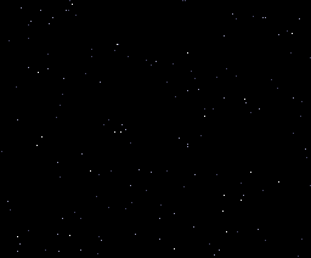

# ROM de demostración de geo3d

[English](README.md) | [Português](README.pt.md) | **Español**

geo3d es un coprocesador 3D diseñado para funcionar en la FPGA del cartucho V9968
de HRA!, para el MSX2 (un proyecto personal, que no forma parte del V9968
oficial). Gira y proyecta los vértices, recorta las aristas contra los bordes de la
pantalla, ordena e ilumina las caras y escribe por sí mismo los comandos LINE y
LRMM en el motor de comandos del V9968. El Z80 solo envía unos pocos bytes por
cuadro. La documentación técnica (mapa de registros, verificación, síntesis)
está en [`../README.md`](../README.md), en inglés.

La ROM de demostración ([`../rom/`](../rom/)) reproduce seis demos en bucle.
Todas las imágenes de esta página se capturaron de esa ROM funcionando en openMSX
(el fork del V9968 con el dispositivo geo3d), a partir de las páginas que mostró
el V9968, con la paleta real (el tiempo, en
[Sobre estos GIF](#sobre-estos-gif)).

## Menú de idioma


Al encender, un menú permite elegir el idioma del texto en perspectiva (el único
texto de las demos) con las teclas **1**, **2**, **3**, o con las flechas arriba y
abajo y **SPACE** o **RETURN**. El resaltado es solo un cambio de paleta. Tras la
elección, las demos se repiten en ese idioma, y la barra espaciadora pasa a la
demo siguiente.

## 1. Texto en perspectiva



También en [inglés](img/crawl_en.gif) y en [portugués](img/crawl_pt.gif).

Un solo plano inclinado, cortado en 75 franjas, con textura LRMM tomada del texto
guardado en la VRAM. En cada cuadro el Z80 solo envía a geo3d la nueva posición
del texto (TEXY), la página donde dibujar y RUN, y el texto se desplaza. Dos
trucos hacen que quepa: el nivel de luz de cada franja sirve también como banco
de textura, de modo que el plano alcanza 1200 filas de textura; y la ventana de
origen del LRMM deja transparente todo lo que queda fuera del texto. El texto
avanza una fila de textura por cuadro y cambia de página tras 3, 3, 3, 2, 3, 3, 3
retrazados verticales, en ciclo (20 retrazados cada 7 cuadros): 0,7 veces los 30 cuadros por segundo de las otras demos,
con todos los cuadros dibujados por completo. La música empieza con el texto (ver
más abajo).

## 2. Modelo de alambre


Un cubo y un octaedro (14 vértices, 24 aristas). El Z80 envía el modelo una sola
vez; en cada cuadro manda 30 bytes (página, una matriz precalculada con la
traslación y RUN), y geo3d transforma todos los vértices, recorta todas las aristas y emite
los comandos LINE. Sin geo3d, el Z80 tendría que hacer los cálculos y escribir
unos 312 valores en los registros de comando del VDP por cuadro.

## 3. Caras sólidas


Los mismos 30 bytes por cuadro, ahora para objetos sólidos: geo3d descarta las
caras traseras, sombrea cada cara según la dirección de la luz, las ordena de la
más lejana a la más cercana y rellena cada una, línea a línea, con comandos LINE
horizontales.

## 4. Caras con textura


Las tapas de las letras llevan textura: cada línea de una cara se convierte en un
comando LRMM que copia texels de una textura guardada en la VRAM, con el paso por
píxel calculado por geo3d. La textura se guarda en 7 copias ya sombreadas, y el
nivel de luz elige la copia. Son unos 405 spans LRMM y 623 LINE por cuadro; el
cuadro más largo, desde RUN hasta el último píxel, tarda 4,1 ms, un cuarto de un
campo de 60 Hz (16,7 ms), medido en la simulación del RTL (`sim/tb_system.v`) con
los comandos rápidos del V9968.

## 5. Paneo y zoom


La cámara se acerca a la G, recorre la palabra, se aleja y hace girar el logotipo.
En cada cuadro el Z80 solo cambia la matriz, la traslación y la distancia focal:
33 bytes para geo3d.

## 6. Llegada de las letras


Las letras llegan una a una sobre un escenario original en SCREEN 5, que el Z80
copia desde la página 3 de la VRAM en cada cuadro con un solo comando HMMM. El Z80
solo reescribe los vértices de las letras en movimiento (hasta tres a la vez);
geo3d transforma y dibuja todas las letras.

## Música

La música empieza con el texto en perspectiva y se desvanece cuando este termina.
Al encender, la ROM busca el mejor chip de sonido disponible y lo usa:

| Chip detectado | Música |
|---|---|
| OPL4 (MoonSound) u OPL3 en C4h | hasta 18 canales FM, más el PSG para percusión de láminas (glockenspiel, vibráfono), arpa, caja y platillos |
| cartucho Konami SCC (cualquier slot) | 5 canales del SCC más los 3 del PSG |
| ninguno de los dos | el PSG (melodía, bajo, armonía, caja y platillos en el canal de ruido) |

La música se convierte a partir de un archivo MIDI al generar la ROM
(`rom/music.py`, `build_rom.py --music ARCHIVO.mid`). Este repositorio no incluye
ningún archivo de música: usa un MIDI que tengas derecho a utilizar. Sin
`--music`, la ROM queda en silencio.

## Cómo ejecutarla

**openMSX.** Las demos necesitan un fork del fork de openMSX para el V9968 hecho
por buppu3 (rama `v9968`). Ese segundo fork (rama `geo3d`, aún no publicado)
añade un pequeño dispositivo geo3d y una corrección para que el V9968 responda
con el ID 3 y active los comandos extendidos y los 256 KB de VRAM (el texto en
perspectiva está por encima de 128 KB). Genera `GEO3D_98.ROM` (V9968 en los
puertos 98h, geo3d en 9Dh/9Fh) y ejecútala en la máquina `C-BIOS_V9968_JP` del
paquete [openmsx-v9968-windows-setup](https://github.com/renatus-xxxx/openmsx-v9968-windows-setup)
de renatus-xxxx:

```
openmsx -machine C-BIOS_V9968_JP -ext geo3d -cart GEO3D_98.ROM -romtype ASCII16
```

Añade `-ext scc` para un cartucho SCC o, para música FM, una MoonSound
(`-ext moonsound`, que necesita su ROM de muestras) o
`-ext OPL3Cartridge_Moonsound_compatible`.

**Hardware real.** `GEO3D.ROM` es una MegaROM ASCII16 de 512 KB para un cartucho
flash en un segundo slot, junto al cartucho V9968 con el bitstream de geo3d y el
interruptor DIP en 88h. La imagen sale por el puerto HDMI del cartucho. La ROM aún
no se ha probado en hardware real.

## Cómo generarla y comprobarla

Se necesita Python 3 con `pillow` y `z80` (pip), el `z80asm` de GNU y las fuentes
DejaVu en `/usr/share/fonts/truetype/dejavu/` (ruta fija: genera en Linux o en
WSL).

```
cd geo3d/rom
python3 build_rom.py                      # GEO3D.ROM, cartucho en 88h
python3 build_rom.py --base 0x98          # GEO3D_98.ROM, openMSX
python3 build_rom.py --music ARCHIVO.mid  # cualquiera de las dos, con música
python3 run_rom_z80.py [--base 0x98] [--lang en|es|pt] [--keys digit|down|up] [--chip psg|scc|opl [--opl4]] [space_at_flip]
```

`run_rom_z80.py` ejecuta la ROM en un emulador de Z80 con pulsaciones de teclado
programadas y comprueba lo siguiente: la imagen del menú y su resaltado, el
idioma elegido, el tráfico en los puertos de cada demo frente a los flujos a
partir de los que se generó la ROM (cotejados con el RTL de geo3d y, en las demos
con textura y en cuadros de muestra, de extremo a extremo con el `vdp_command.v`
de HRA!), la barra espaciadora (`space_at_flip`), los retrazados
verticales antes de cada cambio de página, la música tick a tick en el chip
elegido y el silencio en las demos posteriores al texto en perspectiva.

## Sobre estos GIF

Capturados en openMSX a partir de la ROM, registrando cada cambio de página, la
página visible y la paleta; cada cuadro se muestra durante el mismo tiempo que en
el emulador. Los textos en perspectiva muestran uno de cada dos cuadros de los
primeros 42 segundos, aproximadamente; el modelo de alambre, las caras sólidas y
las caras con textura, una vuelta completa; el paneo y zoom, y la llegada de las
letras, un ciclo completo con uno de cada dos cuadros. El GIF del menú muestra una
imagen por cada tecla pulsada, 1,2 s cada una. Los GIF no tienen sonido.
