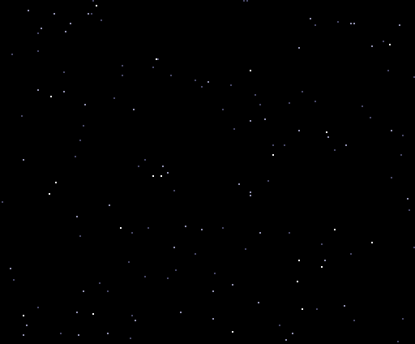

# geo3d demo ROM

**English** | [Português](README.pt.md) | [Español](README.es.md)

geo3d is a 3D coprocessor designed to run in the FPGA of HRA!'s V9968 cartridge
for the MSX2 (a personal project, not part of the official V9968). It rotates and projects the vertices, clips the edges to the screen, sorts and
lights the faces, and writes the LINE and LRMM commands into the V9968 command
engine by itself. The Z80 only sends a few bytes per frame. The technical
documentation (register map, verification, synthesis) is in
[`../README.md`](../README.md).

The demo ROM ([`../rom/`](../rom/)) plays six demos in a loop. Every picture on
this page was captured from that ROM running in openMSX (the V9968 fork with the
geo3d device), from the pages the V9968 displayed, with the real palette (timing
in [About these GIFs](#about-these-gifs)).

## Language menu


At power-on, a menu lets you choose the language of the text crawl (the only
text in the demos) with keys **1**, **2**, **3**, or with the up and down cursor
keys and **SPACE** or **RETURN**. The highlight is only a palette change. After the
choice the demos loop in that language, and the space bar skips to the next
demo.

## 1. Text crawl



Also in [Spanish](img/crawl_es.gif) and [Portuguese](img/crawl_pt.gif).

One tilted plane cut into 75 strips, textured by LRMM with the text kept in
VRAM. Each frame the Z80 only sends geo3d the new text position (TEXY), the page
to draw on and RUN, and the text scrolls. Two tricks make it fit: the light level
of each strip doubles as a texture bank, so the plane reaches 1,200 texture rows,
and the LRMM source window makes everything outside the text transparent. The
crawl moves one texture row per frame and flips pages after 3, 3, 3, 2, 3, 3, 3
vertical blanks, repeating (20 blanks every 7 frames): 0.7 times the 30 frames per second of the other demos, with
every frame drawn in full. The music starts with the crawl (see below).

## 2. Wireframe


A cube and an octahedron (14 vertices, 24 edges). The Z80 uploads the model once;
each frame it sends 30 bytes (page, one precomputed matrix and translation, RUN), and
geo3d transforms every vertex, clips every edge and issues the LINE commands.
Without geo3d the Z80 would do the arithmetic and write about 312 VDP command
register values per frame.

## 3. Solid faces


The same 30 bytes per frame, now for solid objects: geo3d removes the back faces,
shades each face from a light direction, sorts the faces from far to near and
fills each one scanline by scanline with horizontal LINE commands.

## 4. Textured faces


The caps of the letters are textured: each scanline of a face becomes one LRMM
command that copies texels from a texture kept in VRAM, with the per-pixel step
computed by geo3d. The texture is stored as 7 pre-shaded copies, and the light
level picks the copy. About 405 LRMM and 623 LINE spans per frame; the longest
frame, from RUN to the last pixel, takes 4.1 ms, a quarter of one 60 Hz field
(16.7 ms), measured in the RTL simulation (`sim/tb_system.v`) with the V9968's
high-speed commands.

## 5. Pan and zoom


The camera zooms in on the G, pans along the word, zooms out and turns the logo
around. Per frame the Z80 changes only the matrix, the translation and the focal
length: 33 bytes to geo3d.

## 6. Fly-in


The letters arrive one by one over an original SCREEN 5 scene, which the Z80
copies from VRAM page 3 every frame with one HMMM command. The Z80 only rewrites
the vertices of the letters in motion (up to three at once); geo3d transforms and
draws all the letters.

## Music

The music starts with the crawl and fades out when the crawl ends. At power-on,
the ROM looks for the best available sound chip and uses it:

| Chip found | Music |
|---|---|
| OPL4 (MoonSound) or OPL3 at C4h | up to 18 FM channels, plus the PSG for mallets (glockenspiel, vibraphone), harp, snare and cymbals |
| Konami SCC cartridge (any slot) | 5 SCC channels plus the 3 PSG channels |
| None of these | the PSG (melody, bass, harmony, snare and cymbals on the noise channel) |

The music is converted from a MIDI file when the ROM is built
(`rom/music.py`, `build_rom.py --music FILE.mid`). No music file is included in
this repository: supply a MIDI file you have the rights to use. Without
`--music` the ROM is silent.

## Running the ROM

**openMSX.** The demos need a fork of buppu3's V9968 fork of openMSX (branch
`v9968`). That second fork (branch `geo3d`, not yet published) adds a small geo3d
device and a fix so that the V9968 reports ID 3 and enables its extended
commands and 256 KB of VRAM (the crawl text lies above 128 KB). Build
`GEO3D_98.ROM` (V9968 at ports 98h, geo3d at 9Dh/9Fh) and run it on the
`C-BIOS_V9968_JP` machine from renatus-xxxx's
[openmsx-v9968-windows-setup](https://github.com/renatus-xxxx/openmsx-v9968-windows-setup):

```
openmsx -machine C-BIOS_V9968_JP -ext geo3d -cart GEO3D_98.ROM -romtype ASCII16
```

Add `-ext scc` for an SCC cartridge or, for FM music, a MoonSound
(`-ext moonsound`, which needs its wave ROM) or
`-ext OPL3Cartridge_Moonsound_compatible`.

**Real hardware.** `GEO3D.ROM` is a 512 KB ASCII16 MegaROM for a flash cartridge
in a second slot, next to the V9968 cartridge running the geo3d build with its
DIP switch set to 88h. The picture comes out of the cartridge's HDMI port. It
has not yet been tested on real hardware.

## Building and checking

Needs Python 3 with `pillow` and `z80` (pip), GNU `z80asm` and the DejaVu fonts in
`/usr/share/fonts/truetype/dejavu/` (a fixed path: build on Linux or WSL).

```
cd geo3d/rom
python3 build_rom.py                   # GEO3D.ROM, cartridge at 88h
python3 build_rom.py --base 0x98       # GEO3D_98.ROM, openMSX
python3 build_rom.py --music FILE.mid  # either one, with music
python3 run_rom_z80.py [--base 0x98] [--lang en|es|pt] [--keys digit|down|up] [--chip psg|scc|opl [--opl4]] [space_at_flip]
```

`run_rom_z80.py` runs the ROM in a Z80 emulator with a scripted keyboard and
checks the menu picture and its highlight, the chosen language, the port
traffic of every demo compared with the streams the ROM was built from (checked
against the geo3d RTL and, for the textured demos and sampled frames, end to end
with HRA!'s `vdp_command.v`), the space bar (`space_at_flip`), the vertical blanks before each page flip,
the music tick by tick on the chosen chip, and silence in the demos after the
crawl.

## About these GIFs

Captured in openMSX from the ROM, recording every page flip, the displayed page
and the palette; each frame is shown for as long as the emulator displayed it.
The crawls show every second frame of their first 42 seconds or so; the
wireframe, solid and textured demos, one full turn; the pan-and-zoom and fly-in
demos, one full cycle at every second frame. The menu GIF shows one snapshot per
key press, 1.2 s each. The GIFs have no sound.
