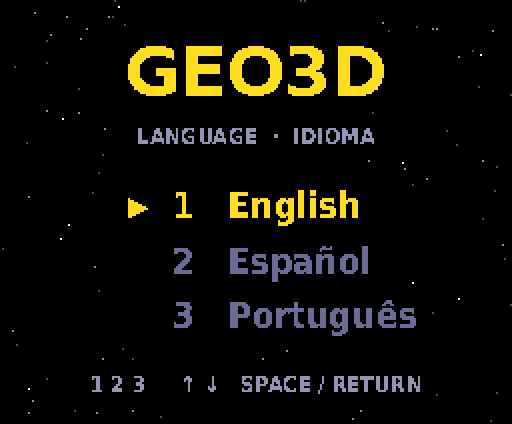
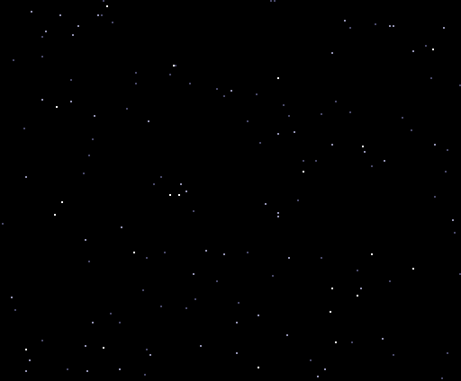
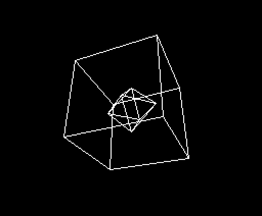
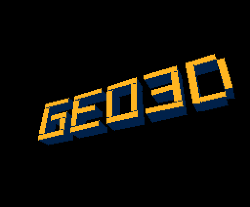
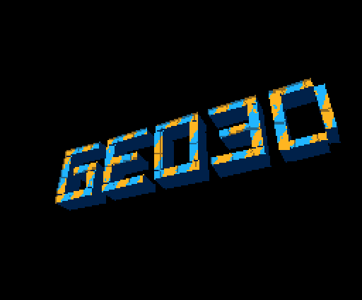
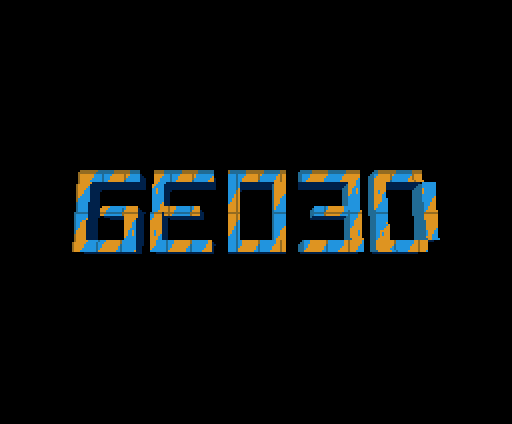
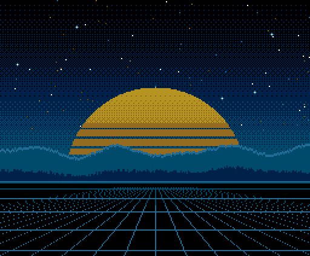

# ROM de demonstração do geo3d

[English](README.md) | **Português** | [Español](README.es.md)

O geo3d é um coprocessador 3D feito para rodar no FPGA do cartucho V9968 do HRA!,
para o MSX2 (um projeto pessoal, que não faz parte do V9968 oficial). Ele gira e projeta os vértices, recorta as arestas nos limites da tela,
ordena e ilumina as faces e escreve sozinho os comandos LINE e LRMM no motor de
comandos do V9968. O Z80 só envia alguns bytes por quadro. A documentação
técnica (mapa de registradores, verificação, síntese) está em
[`../README.md`](../README.md), em inglês.

A ROM de demonstração ([`../rom/`](../rom/)) roda seis demos em sequência, sem
parar. Todas as imagens desta página foram capturadas dessa ROM rodando no
openMSX (o fork do V9968 com o dispositivo geo3d), a partir das páginas que o
V9968 exibiu, com a paleta real (o tempo está em
[Sobre estes GIFs](#sobre-estes-gifs)).

## Menu de idioma



Ao ligar o MSX, um menu permite escolher o idioma do letreiro (o único texto dos
demos) com as teclas **1**, **2**, **3**, ou com as setas para cima e para baixo
e **SPACE** ou **RETURN**. O destaque é só uma troca de paleta. Depois da escolha os demos se
repetem nesse idioma, e a barra de espaço pula para o próximo demo.

## 1. Letreiro



Também em [inglês](img/crawl_en.gif) e em [espanhol](img/crawl_es.gif).

Um único plano inclinado, cortado em 75 faixas, com textura LRMM tirada do texto
guardado na VRAM. A cada quadro o Z80 só envia ao geo3d a nova posição do texto
(TEXY), a página onde desenhar e o RUN, e o texto rola. Dois truques fazem tudo
caber: o nível de luz de cada faixa serve também de banco de textura, e assim o
plano alcança 1.200 linhas de textura; e a janela de origem do LRMM deixa
transparente tudo o que fica fora do texto. O letreiro anda uma linha de textura
por quadro e troca de página depois de 3, 3, 3, 2, 3, 3, 3 retraços verticais,
em ciclo (20 retraços a cada 7 quadros): 0,7 vez os
30 quadros por segundo dos outros demos, com todos os quadros desenhados por
inteiro. A música começa junto com o letreiro (veja abaixo).

## 2. Wireframe



Um cubo e um octaedro (14 vértices, 24 arestas). O Z80 envia o modelo uma vez; a
cada quadro manda 30 bytes (página, uma matriz pré-calculada com a translação e o
RUN),
e o geo3d transforma todos os vértices, recorta todas as arestas e emite os
comandos LINE. Sem o geo3d, o Z80 faria as contas e escreveria cerca de 312
valores nos registradores de comando do VDP por quadro.

## 3. Faces sólidas



Os mesmos 30 bytes por quadro, agora para objetos sólidos: o geo3d descarta as
faces traseiras, sombreia cada face conforme a direção da luz, ordena as faces da
mais distante para a mais próxima e preenche cada uma, linha a linha, com
comandos LINE horizontais.

## 4. Faces com textura



As tampas das letras têm textura: cada linha de uma face vira um comando LRMM que
copia texels de uma textura guardada na VRAM, com o passo por pixel calculado
pelo geo3d. A textura fica guardada em 7 cópias já sombreadas, e o nível de luz
escolhe a cópia. São cerca de 405 spans LRMM e 623 LINE por quadro; o quadro mais
longo, do RUN ao último pixel, leva 4,1 ms, um quarto de um campo de 60 Hz
(16,7 ms), medido na simulação do RTL (`sim/tb_system.v`) com os comandos rápidos
do V9968.

## 5. Pan e zoom



A câmera se aproxima do G, desliza ao longo da palavra, se afasta e gira o
logotipo. A cada quadro o Z80 muda só a matriz, a translação e a distância
focal: 33 bytes para o geo3d.

## 6. Chegada das letras



As letras chegam uma a uma sobre um cenário original em SCREEN 5, que o Z80
copia da página 3 da VRAM a cada quadro com um único comando HMMM. O Z80 só
reescreve os vértices das letras em movimento (até três ao mesmo tempo); o geo3d
transforma e desenha todas as letras.

## Música

A música começa com o letreiro e vai sumindo (fade-out) quando ele termina. Ao
ligar, a ROM procura o melhor chip de som disponível e o usa:

| Chip encontrado | Música |
|---|---|
| OPL4 (MoonSound) ou OPL3 em C4h | até 18 canais FM, mais o PSG para percussão de teclado (glockenspiel, vibrafone), harpa, caixa e pratos |
| cartucho Konami SCC (qualquer slot) | 5 canais do SCC mais os 3 do PSG |
| nenhum dos dois | o PSG (melodia, baixo, harmonia, caixa e pratos no canal de ruído) |

A música é convertida de um arquivo MIDI na hora de gerar a ROM
(`rom/music.py`, `build_rom.py --music ARQUIVO.mid`). Nenhum arquivo de música
faz parte deste repositório: use um MIDI que você tenha o direito de usar. Sem
`--music`, a ROM fica em silêncio.

## Como rodar

**openMSX.** Os demos precisam de um fork do fork do openMSX para o V9968 feito
pelo buppu3 (branch `v9968`). Esse segundo fork ([alexmoncks/openMSX, branch `geo3d`](https://github.com/alexmoncks/openMSX/tree/geo3d)) acrescenta um pequeno dispositivo geo3d e uma correção para o V9968
responder com o ID 3 e habilitar os comandos estendidos e os 256 KB de VRAM (o
texto do letreiro fica acima de 128 KB). Gere a `GEO3D_98.ROM` (V9968 nas portas
98h, geo3d em 9Dh/9Fh) e rode na máquina `C-BIOS_V9968_JP` do pacote
[openmsx-v9968-windows-setup](https://github.com/renatus-xxxx/openmsx-v9968-windows-setup)
do renatus-xxxx:

```
openmsx -machine C-BIOS_V9968_JP -ext geo3d -cart GEO3D_98.ROM -romtype ASCII16
```

Acrescente `-ext scc` para um cartucho SCC ou, para música em FM, uma MoonSound
(`-ext moonsound`, que exige a ROM de amostras dela) ou
`-ext OPL3Cartridge_Moonsound_compatible`.

**Hardware real.** A `GEO3D.ROM` é uma MegaROM ASCII16 de 512 KB para um cartucho
flash num segundo slot, ao lado do cartucho V9968 rodando o bitstream do geo3d,
com a chave DIP em 88h. A imagem sai pela porta HDMI do cartucho. A ROM ainda não
foi testada em hardware real.

## Como gerar e conferir

Requer Python 3 com `pillow` e `z80` (pip), o `z80asm` do GNU e as fontes DejaVu
em `/usr/share/fonts/truetype/dejavu/` (caminho fixo: gere no Linux ou no WSL).

```
cd geo3d/rom
python3 build_rom.py                      # GEO3D.ROM, cartucho em 88h
python3 build_rom.py --base 0x98          # GEO3D_98.ROM, openMSX
python3 build_rom.py --music ARQUIVO.mid  # qualquer uma das duas, com música
python3 run_rom_z80.py [--base 0x98] [--lang en|es|pt] [--keys digit|down|up] [--chip psg|scc|opl [--opl4]] [space_at_flip]
```

O `run_rom_z80.py` roda a ROM num emulador de Z80 com o teclado simulado por
script e confere a imagem do menu e o destaque, o idioma escolhido, o tráfego
nas portas de cada demo em comparação com os fluxos de que a ROM foi gerada
(conferidos com o RTL do geo3d e, nos demos com textura e em quadros de amostra,
de ponta a ponta com o `vdp_command.v` do HRA!), a barra de espaço
(`space_at_flip`), os retraços verticais antes de cada troca de
página, a música tick a tick no chip escolhido e o silêncio nos demos depois do
letreiro.

## Sobre estes GIFs

Capturados no openMSX a partir da ROM, registrando cada troca de página, a
página exibida e a paleta; cada quadro fica na tela pelo mesmo tempo em que o
emulador o exibiu. Os letreiros mostram cerca de 42 segundos a partir do início,
com um a cada dois quadros; o wireframe, as faces sólidas e as faces com
textura, uma volta completa; o pan e zoom e a chegada das letras, um ciclo
completo, também com um a cada dois quadros. O GIF do menu mostra uma imagem por
tecla apertada, 1,2 s cada. Os GIFs não têm som.
